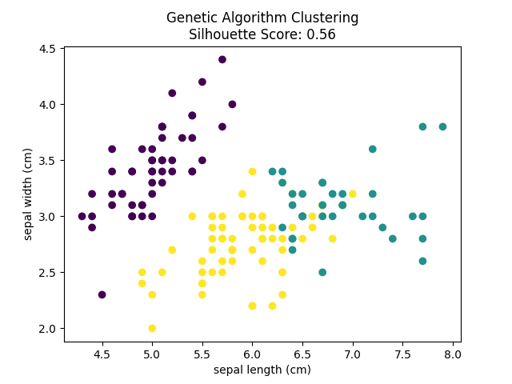
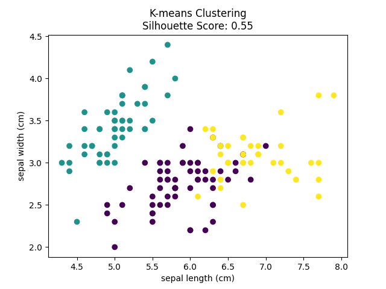

# Genetic Algorithm for Clustering

This project demonstrates the use of a Genetic Algorithm (GA) for clustering the Iris dataset. The GA is compared with the traditional K-means clustering algorithm to evaluate its performance using the Silhouette Score.

---

## Features

- **Genetic Algorithm (GA)**:
  - Uses crossover and mutation to evolve a population of clustering solutions.
  - Optimizes the Silhouette Score to find the best clustering solution.

- **Heuristic Initialization**:
  - Initializes the population with a heuristic seed to improve convergence.

- **K-means Clustering**:
  - Traditional K-means clustering is used as a baseline for comparison.

- **Visualization**:
  - Clustering results are visualized using scatter plots.
---

---

## Dataset

- Dataset: **Iris Dataset** (from `sklearn.datasets`)
- Number of samples: **150**
- Number of features: **4**
- True clusters: **3 (Setosa, Versicolour, Virginica)**

---

## Genetic Algorithm Design

### 1. **Chromosome Representation**
Each chromosome represents a cluster assignment for all data points.  
For example:
```
[0, 1, 2, 0, 1, 2, ...]
```

### 2. **Initialization**
The initial population is randomly generated, except one chromosome seeded by a **heuristic method** inspired by K-Means++ initialization.

### 3. **Operators**
- **Crossover:** Two-point crossover combining segments of parent chromosomes.
- **Mutation:** Randomly changes the cluster assignment of a data point to its nearest neighbor’s cluster (based on a `radius`).
- **Selection:** Top 50% of individuals are selected for reproduction based on fitness.

### 4. **Fitness Function**
The **negative Silhouette Score** is used as the objective to minimize:
```python
fitness = -silhouette_score(data, predicted_labels)
```

### 5. **Termination**
The algorithm runs for a fixed number of generations (default: `200`), evolving the population toward better clustering configurations.

---

## Example Output

After the GA converges, both **GA-based clustering** and **K-Means** results are evaluated using the Silhouette Score and plotted for visual comparison.

   


---

## Adjustable Parameters

You can tweak several parameters in the code:

| Parameter | Description | Default |
|------------|--------------|----------|
| `num_generations` | Number of generations for GA | `200` |
| `population_size` | Size of the GA population | `150` |
| `mutation_rate` | Probability of mutation | `0.5` |
| `radius` | Range for mutation neighbor search | `5` |

---
